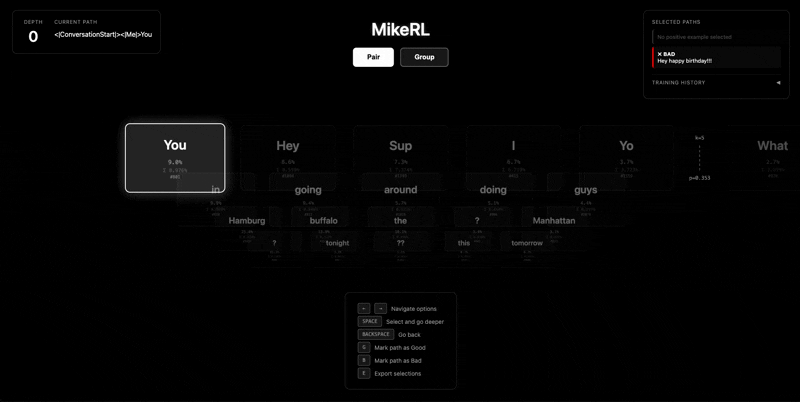

<p align="center">
  
</p>

# MikeGPT

A from-scratch transformer language model trained on 10 years of personal iMessages, with an interactive RL training interface for hands-on alignment and an operations dashboard for monitoring training and system performance. 

A public instance is running at mikegpt.com.

## Setup

```bash
# Clone with the artisinal-lm dependency as a sibling
git clone https://github.com/mrferris/mikegpt.git
git clone https://github.com/mrferris/artisinal-lm.git

cd mikegpt
pip install -r requirements.txt
```

## Run

```bash
python app.py --checkpoint checkpoints/pretrained.pt --admin-password yourpassword
```

- **Chat UI**: [http://localhost:5002](http://localhost:5002)
- **MikeRL** (token tree explorer): [http://localhost:5002/mike-rl](http://localhost:5002/mike-rl)
- **Monitoring dashboard**: [http://localhost:5002/admin](http://localhost:5002/admin)

## MikeRL

<p align="center">
  
</p>

MikeRL is an interactive token tree explorer for reinforcement learning. Navigate the model's probability distribution over next tokens, select good and bad generation paths, and run GRPO training steps to align the model in real time.

**Pair mode**: Explore the token tree, mark a good path and a bad path, and train. Fine-grained control over individual token sequences.

**Group mode**: Generate 8 diverse responses, rank them, and train. Broader learning signal across many outputs at once.

## Data Dashboard

Extract and curate iMessage training data:

```bash
python data_dashboard.py --db ~/Library/Messages/chat.db
```

Open [http://localhost:5001](http://localhost:5001) to browse conversations, select training data, and export to `data/text_data/`.

## Train a Tokenizer

```bash
python tokenization.py data/text_data/imessages_dataset.txt \
  --vocab-size 8192 \
  --output-vocab vocab/mikegpt_vocab_8192.json \
  --output-merges vocab/mikegpt_merges_8192.pkl
```
